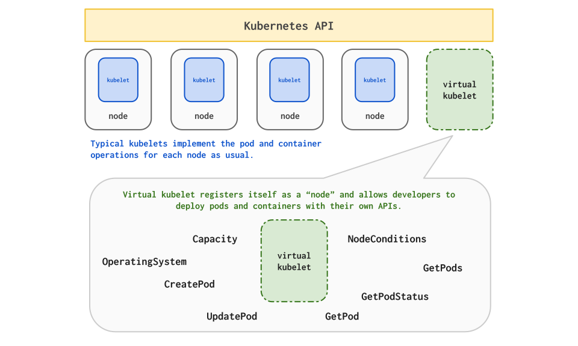

# Virtual Kubelet

Virtual Kubelet is an open source [Kubernetes kubelet](https://kubernetes.io/docs/reference/generated/kubelet/) implementation that masquerades as a kubelet for the purposes of connecting Kubernetes to other APIs. This allows the nodes to be backed by other services like ACI, Hyper.sh, AWS, etc.  This connector features a pluggable architecture and direct use of Kubernetes primitives, making it much easier to build on.

We invite the Kubernetes ecosystem to join us in empowering developers to build
upon our base.

Please note this software is experimental and should not be used for anything
resembling a production workload.

The best description is "Kubernetes API on top, programmable back."

#### Table of Contents

* [How It Works](#how-it-works)
* [Usage](#usage)
* [Providers](#providers)
    + [Azure Container Instances Provider](#azure-container-instances-provider)
    + [Hyper.sh Provider](#hypersh-provider)
    + [Adding a New Provider via the Provider Interface](#adding-a-new-provider-via-the-provider-interface)
* [Testing](#testing)
    + [Testing the Azure Provider Client](#testing-the-azure-provider-client)
* [Contributing](#contributing)

## How It Works

The diagram below illustrates how Virtual-Kubelet works.



## Usage

Deploy a Kubernetes cluster and make sure it's reachable.

Run the binary with your chosen provider:

```bash
./bin/virtual-kubelet --provider <your provider>
```

Now that the virtual-kubelet is deployed run `kubectl get nodes` and you should see
a `virtual-kubelet` node.

## Command-Line Usage

```bash
virtual-kubelet implements the Kubelet interface with a pluggable
backend implementation allowing users to create kubernetes nodes without running the kubelet.
This allows users to schedule kubernetes workloads on nodes that aren't running Kubernetes.

Usage:
  virtual-kubelet [flags]
  virtual-kubelet [command]

Available Commands:
  help        Help about any command
  version     Show the version of the program

Flags:
  -h, --help                     help for virtual-kubelet
      --kubeconfig string        config file (default is $HOME/.kube/config)
      --namespace string         kuberentes namespace (default is 'all')
      --nodename string          kubernetes node name (default "virtual-kubelet")
      --os string                Operating System (Linux/Windows) (default "Linux")
      --provider string          cloud provider
      --provider-config string   cloud provider configuration file
      --taint string             apply taint to node, making scheduling explicit

Use "virtual-kubelet [command] --help" for more information about a command.
```

## Deploy as a Pod by Helm Chart

Run these commands to deploy the virtual kubelet which connects your Kubernetes cluster to Azure Container Instances.
If you want to run the connector from the Azure command-line check out this. 

```bash
RELEASE_NAME=virtual-kubelet
CHART_URL=https://github.com/virtual-kubelet/virtual-kubelet/raw/master/charts/virtual-kubelet-0.1.0.tgz

helm install "$CHART_URL" --name "$RELEASE_NAME" \
    --set env.azureClientId=<YOUR-AZURECLIENTID-HERE>,env.azureClientKey=<YOUR-AZURECLIENTKEY-HERE>,env.azureTenantId=<YOUR-AZURETENANTID-HERE>,env.azureSubscriptionId=<YOUR-AZURESUBSCRIPTIONID-HERE>,env.aciResourceGroup=<YOUR-ACIRESOURCEGROUP-HERE>,env.nodeName=<YOUR-NODE-NAME>, env.nodeOsType=<Linux|Windows>,env.nodeTaint=<YOUR-NODE-TAINT>
```

## Providers

This project features a pluggable provider interface developers can implement
that defines the actions of a typical kubelet.

This enables on-demand and nearly instantaneous container compute, orchestrated
by Kubernetes, without having VM infrastructure to manage and while still
leveraging the portable Kubernetes API.

Each provider may have its own configuration file, and required environmental variables.

### Azure Container Instances Provider

The Azure Container Instances Provider allows you to utilize both
typical pods on VMs and Azure Container instances simultaneously in the
same Kubernetes cluster.

```bash
./bin/virtual-kubelet --provider azure
```

#### Environment Variables

`ACI_RESOURCE_GROUP` must be set to the name of a valid Azure resource group where your
ACI workload will be run.

`ACI_REGION` must be set to the name of the region your `ACI_RESOURCE_GROUP` was created.

#### Configuration File

The Azure connector can use a configuration file specified by the `--provider-config` flag.
The config file is in TOML format, and an example lives in `providers/azure/example.toml`.

### Hyper.sh Provider

The Hyper.sh Provider allows Kubernetes clusters to deploy Hyper.sh containers
and manage both typical pods on VMs and Hyper.sh containers in the same
Kubernetes cluster.

```bash
./bin/virtual-kubelet --provider hyper
```

### Adding a New Provider via the Provider Interface

The structure we chose allows you to have all the power of the Kubernetes API
on top with a pluggable interface.

Create a new directory for your provider under `providers` and implement the
following interface. Then add your new provider under the others in the
[`vkubelet/provider.go`](vkubelet/provider.go) file.

```go
// Provider contains the methods required to implement a virtual-kubelet provider.
type Provider interface {
	// CreatePod takes a Kubernetes Pod and deploys it within the provider.
	CreatePod(pod *v1.Pod) error

	// UpdatePod takes a Kubernetes Pod and updates it within the provider.
	UpdatePod(pod *v1.Pod) error

	// DeletePod takes a Kubernetes Pod and deletes it from the provider.
	DeletePod(pod *v1.Pod) error

	// GetPod retrieves a pod by name from the provider (can be cached).
	GetPod(namespace, name string) (*v1.Pod, error)

	// GetPodStatus retrievesthe status of a pod by name from the provider.
	GetPodStatus(namespace, name string) (*v1.PodStatus, error)

	// GetPods retrieves a list of all pods running on the provider (can be cached).
	GetPods() ([]*v1.Pod, error)

	// Capacity returns a resource list with the capacity constraints of the provider.
	Capacity() v1.ResourceList

	// NodeConditions returns a list of conditions (Ready, OutOfDisk, etc), which is polled periodically to update the node status
	// within Kuberentes.
	NodeConditions() []v1.NodeCondition

	// OperatingSystem returns the operating system the provider is for.
	OperatingSystem() string
}
```

## Testing

Running the unit tests locally is as simple as `make test`.

### Testing the Azure Provider Client

The unit tests for the [`azure`](providers/azure/) provider require a `credentials.json`
file exist in the root of this directory or that you have `AZURE_AUTH_LOCATION`
set to a credentials file.

You can generate this file by following the instructions listed in the
[README](providers/azure/client/README.md) for that package.


## Contributing

This project welcomes contributions and suggestions.  Most contributions require you to agree to a
Contributor License Agreement (CLA) declaring that you have the right to, and actually do, grant us
the rights to use your contribution. For details, visit https://cla.microsoft.com.

When you submit a pull request, a CLA-bot will automatically determine whether you need to provide
a CLA and decorate the PR appropriately (e.g., label, comment). Simply follow the instructions
provided by the bot. You will only need to do this once across all repos using our CLA.

This project has adopted the [Microsoft Open Source Code of Conduct](https://opensource.microsoft.com/codeofconduct/).
For more information see the [Code of Conduct FAQ](https://opensource.microsoft.com/codeofconduct/faq/) or
contact [opencode@microsoft.com](mailto:opencode@microsoft.com) with any additional questions or comments.
