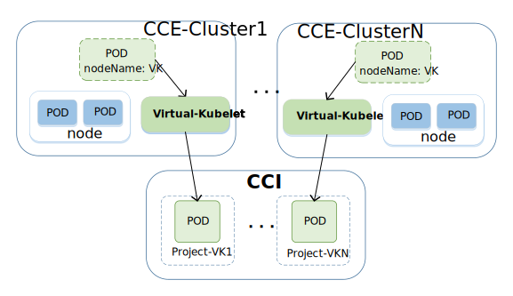

# Huawei CCI

Huawei CCI [(Cloud Container Instance)](https://www.huaweicloud.com/product/cci.html) service provides serverless container management, 
and does not require users to manage the cluster and the server. 
Only through simple configuration, users can enjoy the agility and high performance of the container.
CCI supports stateless workloads (Deployment) and stateful workload (StatefulSet).
On the basis of Kubernetes, we have made a series of important enhancements such as secure container,
 elastic load balancing, elastic scalability, Blue Green Deployment and so on.

## Huawei CCI Virtual Kubelet Provider

Huawei CCI virtual kubelet provider configures a CCI project as node in any of your Kubernetes cluster, 
such as Huawei CCE [(Cloud Container Engine)](https://www.huaweicloud.com/en-us/product/cce.html).
CCE supports native Kubernetes applications and tools as private cluster, allowing you to easily set up a container runtime environment. 
Pod which is scheduled to the virtual kubelet provider will run in the CCI, that will makes good use of the high performance of CCI.
The diagram below illustrates how Huawei CCI virtual kubelet provider works.  

  

**NOTE:** The Huawei CCI virtual-kubelet provider is in the early stages of development,
and don't use it in a production environment.

## Prerequisites

You must install the provider in a Kubernetes cluster and connect to the CCI, and also need create an account for CCI.
Once you've created your account, then need to record the aksk, region for the configuration in next step.

## Configuration

Before run CCI Virtual Kubelet Provider, you must do as the following steps.  
1. Create a configuration profile. 
You need to provide the fields you specify like in the [example fils](cci.toml).  
2. Copy your AKSK and save them in environment variable:
```console
export APP_KEY="<AppKey>"
export APP_SECRET="<AppSecret>"
```

## Connect to CCI from your cluster via Virtual Kubelet

On the Kubernetes work node, starting a virtual-kubelet process as follows.

```console
virtual-kubelet --provider huawei --provider-config cci.toml
```
Then run ``kubectl get nodes`` in your cluster to validate the provider has been running as a node.

```console
kubectl get nodes
NAME                            STATUS       AGE       
virtual-kubelet                 Ready        5m        
cce-192.168.0.178               Ready        10d       
cce-192.168.0.233               Ready        10d      
```
If want to stop the virtual kubelet, just stop the virtual kubelet process.

## Schedule pod to CCI via Virtual Kubelet

```console
apiVersion: v1
kind: Pod
metadata:
  name: myapp
  labels:
    app: myapp
spec:
  nodeName: virtual-kubelet
  containers:
  - name: nginx
    image: 1and1internet/ubuntu-16-nginx
    imagePullPolicy: IfNotPresent
    ports:
    - containerPort: 8080
  tolerations:
  - key: huawei.com/cci
    effect: NoSchedule
```
Replace the nodeName to the virtual-kubelet nodename and save the configuration to a file ``virtual-kubelet-pod.yaml``.
Then run ``kubectl create -f virtual-kubelet-pod.yaml`` to create the pod. Run ``kubectl get pods -owide`` to get pods.

```console
kubectl get pods -o wide
NAME                                            READY     STATUS    RESTARTS   AGE       IP             NODE
myapp-7c7877989-vbffm                           1/1       Running   0          39s       172.17.0.3     virtual-kubelet
```
