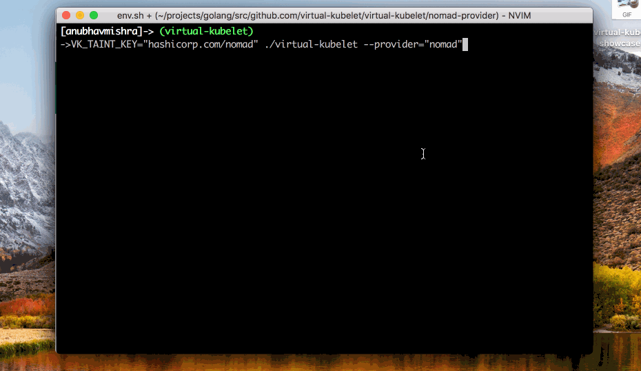

# HashiCorp Nomad Provider for Virtual Kubelet

HashiCorp [Nomad](https://nomadproject.io) provider for Virtual Kubelet connects your Kubernetes cluster
with Nomad cluster by exposing the Nomad cluster as a node in Kubernetes. By
using the provider, pods that are scheduled on the virtual Nomad node
registered on Kubernetes will run as jobs on Nomad clients as they
would on a Kubernetes node.

**This is an experimental project. This project isn't production ready.**

## Demo



## Prerequisites

This guide assumes the following:

* A Nomad cluster up and running.
* A Kubernetes cluster up and running.
* The Nomad API is accessible from the Kubernetes cluster.
* [kubectl](https://kubernetes.io/docs/tasks/tools/install-kubectl/#install-kubectl) installed.

## Usage

The Nomad provider accepts the following two environment variables:

* `NOMAD_ADDR` - The Nomad API address. Set to `127.0.0.1:4646` by default.
* `NOMAD_REGION` - The Nomad region. Set to `global` by default.

```bash
export NOMAD_ADDR="127.0.0.1:4646"
export NOMAD_REGION="global"
```

### Run Virtual Kubelet with Nomad Provider

```bash
VK_TAINT_KEY="hashicorp.com/nomad" ./virtual-kubelet --provider="nomad"
```

Validate that the virtual kubelet node is registered.

```bash
kubectl get nodes
```

Expected output.

```bash
NAME              STATUS    ROLES     AGE       VERSION
minikube          Ready     master    55d       v1.10.0
virtual-kubelet   Ready     agent     1m        v1.13.1-vk-N/A
```

### Create a Pod in Kubernetes

```bash
kubectl apply -f pods/nginx-pod.yaml
```

Validate pod.

```bash
kubectl get pods
```

Expected output.

```bash
NAME      READY     STATUS    RESTARTS   AGE
nginx     1/1       Running   0          1m
```

Validate Nomad job.

```bash
nomad status
```

Expected output.

```bash
ID                           Type     Priority  Status   Submit Date
nomad-virtual-kubelet-nginx  service  100       running  2018-12-31T16:52:52+05:30
```

### Configuration Options

The Nomad provider has support for annotations to define Nomad [datacenters](https://www.nomadproject.io/docs/job-specification/job.html#datacenters).

Here is an example usage of the Nomad datacenter annotations in a pod spec.

```yaml
apiVersion: v1
kind: Pod
metadata:
  name: nginx
  annotations:
    "nomad.hashicorp.com/datacenters": "us-east1,us-west1"
spec:
  containers:
  - image: nginx
    imagePullPolicy: Always
    name: nginx
    ports:
    - containerPort: 80
    - containerPort: 443
  dnsPolicy: ClusterFirst
  nodeSelector:
    kubernetes.io/role: agent
    beta.kubernetes.io/os: linux
    type: virtual-kubelet
  tolerations:
  - key: virtual-kubelet.io/provider
    operator: Exists
  - key: hashicorp.com/nomad
    effect: NoSchedule
```
