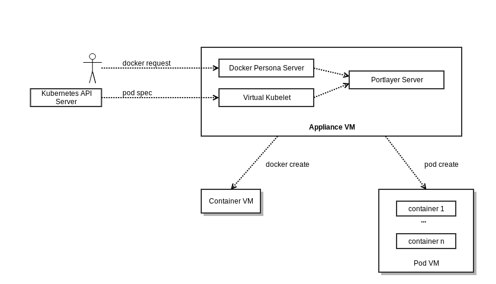
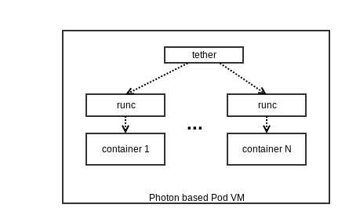

# vSphere Integrated Containers virtual kubelet provider

This is a very early preview of the [VMware vSphere Integrated Containers](https://github.com/vmware/vic) virtual kubelet provider.

## Introduction to vSphere Integrated Containers

For those who are unfamiliar with vSphere Integrated Containers, it is a open source project that enables users to create a CaaS (container as a service) endpoint on a vSphere cluster.  There are a few advantages of using vSphere Integrated Containers over using standard Docker in a VM:

1. Containers are wrapped in VMs and provides stronger isolation than a standard OS containers.
1. Use of vSphere Integrated Containers removes the need to deploy a host VM, OS, and docker software.  It also removes the requirement to maintain that stack.  An administrator can simply deploy a VCH (virtual container host) and get back a docker endpoint.  With this endpoint, users can deploy containers.  vSphere manages the endpoint.
1. The VCH can span a vCenter cluster, providing a much larger virtual host than any VM or physical machine on which users can deploy their containers. Users can deploy containers across the entire vCenter cluster using this single virtual host.

## Virtual Kubelet in vSphere Integrated Containers

Within a deployed VCH, there is a daemon that provides a Docker compatible endpoint.  We refer to this daemon as a Docker personality server.  With the vSphere integrated Container virtual kubelet provider, we are introducing a second personality server that provides a Kubelet compatible endpoint for the VCH.  With this endpoint, the VCH can join a kubernetes cluster, providing a robust virtual node for pods.  Just as the VCH provides a CaaS endpoint for Docker users, it will now provide a Pod-as-a-Service endpoint for kubernetes users.  vSphere manages the availability of the pods and remove the need for administrators to maintain the uptime of a normal node, it's software, and the pods running on it.  For the user, it provides a much larger virtual node than any single VM or physical machine.

## Pod VM in vSphere Integrated Containers

With the vSphere integrated Container virtual kubelet provider, we are also introducing a new isolation concept called the pod vm.  With the original vSphere Integrated Containers, we introduced stronger container isolation through our container vm concept.  Interested parties may go to the vSphere Integrated Containers github project page to read all about it.  A standard pod in a standard kubernetes node is just a collection of containers with a parent container.  The containers are isolated by the OS, but the pod is not.  With vSphere Integrated Containers, pods are strongly isolated within a pod vm.  Each pod runs within it's own pod vm.

## Project Status

This is an early preview.  The project relies on a feature branch within the vSphere Integrated Containers project.  Currently, pods can be created and removed.  Some node statuses can be queried.  This provider reuses vSphere Integrated Containers to provision pods.  As such, there is a dependency between this provider and the vSphere Integrated Containers project.  All changes to that project are currently being done on a feature branch, named wolfpack. 

There are a lot of kubelet features still undefined in the virtual-kubelet project, such as networking, volumes, exec, logging, etc.  As these are defined, we will add this support into our provider and into vSphere Integrated Containers.

## Building vSphere Integrated Containers with virtual kubelet support

This project and the associated vSphere Integrated Containers project are in active development.  The simplest way to utilize this virtual kubelet provider, is to build the kubelet project and the wolfpack feature branch of vSphere Integrated Containers.  The following is a step by step instructions on building both.  There is an asciinema playback of this process below.  The current instructions assumes your development environment is Linux.

First, ensure golang 1.8.x and git are installed on your machine.  The vSphere Integrated Containers project checks for go 1.8.  Next, perform the following steps

1. make sure you have go 1.8.x and prepare your GOPATH
    * $> `go version`
    * $> `mkdir -p go/src/github.com/virtual-kubelet`
1. get and build the virtual kubelet
    * $> `cd go/src/github.com/virtual-kubelet`
    * $> `git clone https://github.com/virtual-kubelet/virtual-kubelet.git`
    * $> `cd virtual-kubelet`
    * $> `go build .`
1. get wolfpack feature branch of vSphere Integrated Containers
    * $> `cd`
    * $> `mkdir -p go/src/github.com/vmware`
    * $> `cd $GOPATH/src/github.com/vmware`
    * $> `git clone https://github.com/vmware/vic`
    * $> `cd vic`
    * $> `git checkout feature/wolfpack`
1. build vSphere Integrated Containers **as root**
    * $> `cd $GOPATH/src/github.com/vmware/vic`
    * $> `sudo su`
    * $> `export GOPATH=/home/[user]/go`
    * $> `export PATH=$PATH:/usr/local/go/bin:/home/[user]/go/bin`
    * $> `export VIRTUAL_KUBELET_PATH=$GOPATH/src/github.com/virtual-kubelet/virtual-kubelet/virtual-kubelet`
    * $> `make most-vkubelet`
    * $> `chown -R user:user *`
    * $> `exit` (exit root)

You should now have a **bin** folder in the vic folder.  This contains all the necessary assets to deploy a VCH using the vic-machine CLI.

[Asciinema recording of the build steps](https://asciinema.org/a/oeGbhPmKWqVgWeQxCOPLHCcYN)

## Usage

To get started with the vSphere Integrated Containers' virtual kubelet, users should first familiarize themselves with deploying vSphere Integrated Containers and using the VCH as a docker endpoint.  We're leveraging the same deployment model with the virtual kubelet.  Administrators deploy a VCH, using the vic-machine CLI or [VIC Appliance](https://github.com/vmware/vic-product), specifying the kubernetes cluster that the VCH should join.  

Virtual Container Hosts should be deployed with the proper CLI flags to enable virtual kubelet, including both `--k8s-server-address` and `--k8s-config`.

Once the VCH is fully started, it automatically joins the cluster.  Administrators can then apply taints or labels to the virtual node to create node affinity.  Pods created with the right toleration or nodeSelector will then be deployed onto the VCH.

1. Get IP or FQDN of your kubernetes master node
2. Get location of your kube config you use for kubectl (usually in $HOME/.kube/config)
3. Deploy a virtual container host with vic-machine.
4. $> `kubectl get nodes`
5. Deploy a pod

[Asciinema recording of an example usage](https://asciinema.org/a/nArPOJSKWJwx09UsJVUFiI2y7)