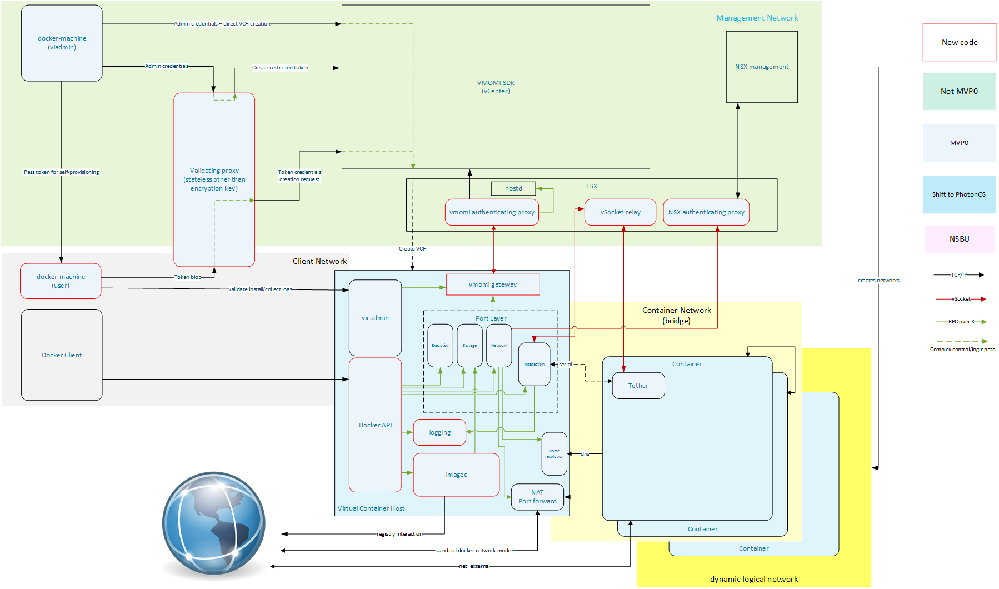

# vSphere Integrated Containers - Architecture and Design

## Approach

The development approach taken for VIC is iterative refinement, both for the high level product and recursively throughout the lower level components that go into it. This, as with most Agile processes, is driven by a need to have a useful product in short timeframes, and to manage risk - whether risk related to larger delivery deadlines (VIC may be OSS but it's still a VMware product), changing technical landscapes, or the unknown. The day-by-day development process we follow is [documented in the contributor docs](../../CONTRIBUTING.md).

The upshot of this approach is that many of these components are outline sketches at best as we start out, with specific areas being filled out over time. Avoiding any comment on business priorities, the _technical_ priorities for the project are:

1. build an appliance foundation to permit secure orchestration of Virtual Infrastructure by regular users
2. build primitives that support container style semantics, implemented with VMs
2. present a Docker API endpoint though which users can orchestrate vSphere resources, within the scope of the Virtual Container Host

The primary _goal_ of the project is to be useful to users - very simple to say, but much more involved to achieve. Our expectation is that most users will consume VIC via the Docker API, therefore if you have specific requirements around docker function support please raise them as issues if they are not already documented in #445 - if they are, add a +1. We will be focusing on function required on the production end of the CI pipeline initially, but knowing what _you_ require for our initial releases to be useful in that scope is invaluable.


## Components

- [Component Architecture](#component-architecture)
- [Container](#container)
  - [Container Base](#container-base)
  - [Tether](#tether)
  - [Container Logging](#container-logging)
- [Appliance](#appliance)
  - [Appliance Base](#appliance-base)
  - [vicadmin](#vicadmin)
  - [Docker API server](#docker-api-server)
  - [imagec](#imagec)
  - [Port Layer](#port-layer)
    - [Port Layer - Execution](#port-layer---execution)
    - [Port Layer - Interaction](#port-layer---interaction)
    - [Port Layer - Networking](#port-layer---networking)
    - [Port Layer - Storage](#port-layer---storage)
- [Install and management](#install-and-management)
  - [vic-machine](#vic-machine)
  - [Validating Proxy](#validating-proxy)
- [ESX Agents](#esx-agents)
  - [VMOMI Authenticating Agent](#vmomi-authenticating-agent)
  - [vSocket Relay Agent](#vsocket-relay-agent)
  - [NSX Authenticating Agent](#nsx-authenticating-agent)


## Component Architecture

This is a component architecture for the system, encompassing some of the main control flows. It is intended to be used as a visual map for which components interact and how those interaction occur; it does not indicate what those interaction are. Components are marked as _new code_ are entirely new for vSphere Integrated Containers, where as others are either part of vSphere or we have a functioning reference implementation from Project Bonneville.




## Container
### Container Base

ContainerVMs are bootstrapped from a PhotonOS based liveCD, containing just enough to boot Linux and set up the container filesystem, before performing a switch_root into the container root filesystem. The end result is a VM:
* running the PhotonOS kernel, with appropriate kernel modules for demand loading
* the specified container filesystem mounted as `/`
* [a custom init binary](#tether) that provides the command & control channel for container interaction

The container process runs as root with full privileges, however there's no way to make persistent changes to anything except the container filesystem - the core operating files are read-only on the ISO and refresh each time the container is started.

[Issues relating to this component](https://github.com/vmware/vic/labels/component%2Fcontainer-base)


### Tether

The tether is an init replacement used in containerVMs that provides the command & control channel necessary to perform any operation inside the container. This includes launching of the container process, setting of environment variables, configuration of networking, etc. The tether is currently based on a modified SSH server tailored specifically for this purpose.

[Additional detail](tether.md)
[Issues relating to tether](https://github.com/vmware/vic/labels/component%2Ftether)


### Container Logging

Container logging, as distinct from other logging mechanisms, is the capture mechanism for container output. This fills the same niche as [Docker log drivers](https://docs.docker.com/engine/admin/logging/overview/) and has the potential to be a direct consumer of docker log drivers.

As of the v0.1 release logs are being persisted on the datastore along with the VM.

[Issues relating to container logging](https://github.com/vmware/vic/labels/component%2Fcontainer-logging)


## Appliance
### Appliance Base

The appliance VM is bootstrapped from a PhotonOS based liveCD that embeds elements of VIC relevant to Virtual Container Host functions. The appliance is diskless _in essence_, but may well use a non-persistent disk to cache transient data such as docker images in-flight from [Docker Hub](https://hub.docker.com/) but not yet persisted to a datastore.

The ISO used to bootstrap the appliance is generated from the following make targets - only the first must be specified as the others are pre-requisites:
```
make appliance appliance-staging iso-base
```

The intent behind having the appliance be diskless and bootstrap off an ISO each time is:
* improved security - coupled with [the configuration mechanism](configuration.md#Configuration-persistence-mechanism) there's no way to make persistent changes without vSphere API access
* robustness - a reboot will return the appliance to a known good state, assuming an administrator has not altered the configuration in the meantime
* simplicity of update - using [vic-machine](#vic-machine) to update a VCH should be as simple as pointing the appliance VM at a new ISO version and rebooting, so long as there's no metadata migration needed; in that case the migration should be viable as a background task prior to VCH update.

[Issues relating to appliance base](https://github.com/vmware/vic/labels/component%2Fappliance-base)


### vicadmin

This is more speculative than any of the other components at this point. We fully expect there to be a need for user level inspection/administration of a deployed Virtual Container Host, however we've not yet identified the functions this should provide.

Current list of functions:
* log collection

Speculative list of functions (via docker-machine as a client?):
* docker API user management
* reconfigure operations (e.g. add --insecure-registry)

[Issues relating to vicadmin](https://github.com/vmware/vic/labels/component%2Fvicadmin)


### Docker API server

This is the portion of a Virtual Container Host that provides a Docker API endpoint for users to interact with; it is also referred to as a 'personality'. The longer term design has multiple personalities running within a single VCH, such that the same endpoint can serve mixed API versions, and the same VCH can serve multiple API flavours.

As of the v0.1 release this makes use of the [docker engine-api](https://github.com/docker/engine-api) project to ensure API compatibility with docker.

The following is commentary about why the docker API server is not actual Docker. It's not usual design doc content, but is a question that comes up enough that it becomes core to understanding the design.

[Issues relating to docker API](https://github.com/vmware/vic/labels/component%2Fdocker-api-server)

#### Commentary

There are frequently questions asked about why we're not using Docker directly and supplying exec, graph and libnetwork drivers, which is the approach we took with [Project Bonneville](http://blogs.vmware.com/cloudnative/introducing-project-bonneville/). People who are intimately familiar with the container space may also ask why we're not using the OCI components such as runc.

Being very open here, the answer comes back to the reasoning behind the [approach](#approach) - it was a choice made when starting VIC in January 2016 to manage technical and project risks, and it's a trade against business risk (community perception, customer concerns about compatibility, and others).

Some of the major technical assumptions in the Docker code base do not hold true for VIC (as of decision nexus date):

1. container filesystems exist on the same host the daemon is running on
2. namespaces can be created independently of containers (e.g. libnetwork sets up interfaces prior to graphdriver.Create)
3. operations on namespaces are _relatively_ cheap in terms of performance
4. container lifecycles are tied to that of the docker daemon
5. no orthogonal second management plane

As Docker continues with decomposition of the monolithic docker daemon into components, our ability to consume those components directly increases, and there are very good reasons to do so - not least is the fact it reduces the development and maintenance burden on the VIC team. In line with the stated approach, as docker components become available that can be consumed, we will.

A good example of the planned approach regarding docker is our use of the engine-api project -- VIC was initially using a Docker API server generated from a swagger specification. Once the engine-api project became somewhat stable we contributed the swagger spec to that project and are now consumers of the engine-api directly.

This leads to another question regarding why we don't simply invest our project resources in helping Docker decompose the daemon. Again the answer comes back to risk management - Docker's priorities are not VMware's and, without a formal partnership, assuming the decomposition stays on a schedule that's viable for VIC deadlines is, well, risky. This is a fine line to walk as we _want_ to be good community members and, from a more selfish perspective, don't want to invest in quickly deprecated code. Our intent is to, as with the engine-api project, move to the docker and OCI components as they become semi-stable and invest resource in them at that point - how early in the life of a given component we can do that is a function of deadlines, resources and politics.


### imagec

The component follows the naming pattern introduced by OCI with 'runc' and is a docker registry client library, purely concerned with the pull/push aspects of the registry with login becoming a transitive dependency.

[Current open issues relating to imagec](https://github.com/vmware/vic/labels/component%2Fimagec)


### Port Layer

The port layer presents container primitive operations, with APIs that express intent rather than the intricacies of how.

#### Port Layer - Execution

This component handles management of containers such as create, start, stop, kill, etc, and is broken distinct from interaction primarily because the uptime requirements may be different, [see Interaction](#portlayer---interaction).

[Issues relating to portlayer execution](https://github.com/vmware/vic/labels/component%2Fportlayer%2Fexecution)


#### Port Layer - Interaction

This component deals handles interaction with a running container and is broken distinct from execution primarily because the uptime requirements may be different.

If the execution portion of the port layer is unavailable then only container management operations around creating, starting, stopping, et al are impacted, and then only for as long as the VCH is unavailable.

If the interaction portions are unavailable it impacts ongoing use of interactive sessions and potentially loses chunks of the container output (unless serialized to vSphere infrastructure as an intermediate step - [container logging](#container-logging), [container base](#container-base), and [tether](#tether)) are the other components that factor into the log persistence discussion).

[Issues relating to portlayer interaction](https://github.com/vmware/vic/labels/component%2Fportlayer%2Finteraction)


#### Port Layer - Networking

A Virtual Container Host presents a cluster of resources as a single endpoint, so while we must also supply transparent cross host networking, it must be there without requiring any user configuration.
In conjunction with [the provisioning workflows](#vic-machine) it should also allow mapping of specific vSphere/NSX networks into the docker network namespace, and mapping of existing network entities (e.g. database servers) into the docker container namespace with defined aliases.

Initial design and implementation details for MVP are [here](networking/README.md).

[Issues relating to portlayer networking](https://github.com/vmware/vic/labels/component%2Fportlayer%2Fnetwork)


#### Port Layer - Storage

This provides the storage manipulation portions of the port layer, including container image storage, layering along with volume creation and manipulation. [imagec](#imagec) uses this component to translate registry images into a layered format the can be used directly by vSphere, namely VMDK disk chains.

[Issues relating to portlayer storage](https://github.com/vmware/vic/labels/component%2Fportlayer%2Fstorage)


#### VMOMI gateway

This is the GuestOS side of the [VMOMI authenticating proxy](#vmomi-authenticating-proxy) that provides a 'paravirtual' vmomi interface to the underlying vSphere infrastructure. This is structured as a library for direct consumption by other components, for example [vic-machine](#vic-machine), and may be wrapped in a service presenting a URI endpoint for shared consumption between components such as portlayer and vicadmin. This latter approach is less secure by virtue of exposing that mechanism generally within the Appliance, but has the benefit of simplicity regarding managing multiple connections over a single channel.

[Issues relating to portlayer storage](https://github.com/vmware/vic/labels/component%2Fvmomi%2Fgateway)


## Install and management

### vic-machine

The _docker-machine_ mechanism is something of a de-facto standard for provisioning docker hosts.
There is a significant amount of vSphere specific behaviour that needs to be exposed that may well go beyond what docker-machine provides - hence supplying a vic-machine binary.

Ideally we'll provide vic-machine in a form that makes it viable as a docker-machine plugin, allowing some reuse of existing knowledge, with VIC specific options and behaviours presented to the user via plugin options.
It is possible that the value provided by keeping the _docker-machine_ naming is overshadowed by the flexibility that changing the name provides (perhaps _vic-machine_) - lacking concrete knowledge one way or another, this component is currently named vic-machine so as to avoid confusion with the docker binary.

While deployment of a Virtual Container Host is relatively simple if performed by someone with vSphere administrative credentials, conversations with customers have shown that the self-provisioning facet of docker is a significant portion of it's value. This component, in conjunction with [the validating proxy](#validating-proxy), provides self-provisioning capabilities and the requisite delegation of authority and specification of restrictions.

[Issues relating to vic-machine](https://github.com/vmware/vic/labels/component%2Fvic-machine)


### Validating Proxy

The self-provisioning workflow for vSphere Integrated Containers is an authority delegation and resource restriction model. That requires that there be an active endpoint accessible to both the user and the viadmin that is capable of generating delegation tokens to be passed to the user, and validating those that are received from a user. The validating proxy fills this niche; the described proxy is very, very simple and does not include elements such as directory services integration.

[Issues relating to validating proxy](https://github.com/vmware/vic/labels/component%2Fvalidating-proxy)


## ESX Agents

### VMOMI Authenticating Agent

As with [access to NSX management](#nsx-authenticating-agent), vSphere orchestration requires credentials and therefore credential management. The authenticating agent is intended to move the credential management problem out of the VCH and into the vSphere infrastructure. Authorizing the VCH to perform specific operations by virtue of being a specific VM (and potentially cryptographically verified), rather than generating and embedding credentials into the guest, means:
* a VCH can be safely considered untrusted
* IDS style inspection and validation can be performed on each infrastructure operation performed by a VCH
* no access to management networks is required for infrastructure orchestration


[Issues relating to vmomi agent](https://github.com/vmware/vic/labels/component%2Fvmomi-authenticating-agent)


# vSocket Relay Agent

Network serial ports as a communication channel have several drawbacks:
* serial is not intended for high bandwidth, high frequency data
* inhibits forking & vMotion without vSPC, and a vSPC requires an appliance in FT/HA configuration
* requires a VCH have a presence on the management networks
* requires opening a port on the ESX firewall

The alternative we're looking at is vSocket (uses PIO based VMCI communication), however that it Host<->VM only so we need a mechanism to relay that communication to the VCH. Initially it's expected that the Host->VCH communication still be a TCP connection for a staged delivery approach, with the longer term being an agent<->agent relay between the two hosts.

[Issues relating to vsocket relay agent](https://github.com/vmware/vic/labels/component%2Fvsocket-relay-agent)


### NSX Authenticating Agent

As with [access to vSphere](#vmomi-authenticating-agent), NSX management interaction requires credentials and therefore credential management. The authenticating agent is indended to move the credential management problem out of the VCH and into the vSphere infrastructure. Authorizing the VCH to perform specific operations by virtue of being a specific VM (and potentially cryptographically verified), rather than generating and embedding credentials into the guest, means:
* a VCH can be safely considered untrusted
* IDS style inspection and validation can be performed on each infrastructure operation performed by a VCH
* no access to management networks is required for infrastructure orchestration

[Issues relating to nsx agent](https://github.com/vmware/vic/labels/component%2Fnsx-authenticating-agent)
