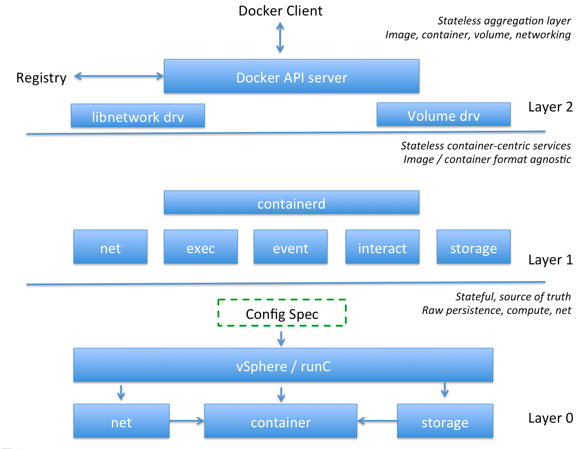

**Containerd Integration Draft**

**Summary**

Docker’s Containerd project aims to present an API surface representing all of the core functions of a container runtime on a single host. This includes image resolution, image pull, container and image lifecycle management, events, metrics, execution of processes and interactive sessions.

Network and volume management are out of scope for containerd which will expect to reference already-existing networks and storage.

http://containerd.io/

https://github.com/docker/containerd

**Relevance to VIC**

The scope of the Docker personality in VICe (VIC engine) is currently as an enterprise container _runtime_, very much the same scope as containerd. The main difference between the two is that in VIC, clustering, HA and other enterprise features are integrated transparently below the user API boundary. With regular containerd, it is assumed that these features will exist above the API in the application layer and that containerd manages containers on a single literal host (guest OS on physical harware or VM). The VIC integration will see containerd managing container workloads in a "virtual host" (vSphere resource pool), but the goal is for this to be completely transparent to the containerd consumer.

The goals of integrating VICe with containerd are the following:

* Be API complete with an industry-standard API that better encapsulates the scope of VIC.

* Reach some degree of compatibility with the OCI image format. This is a requirement of containerd.

* Reuse more common Docker code. It is anticipated that containerd will be part of a larger refactoring effort that will enable us to integrate better with Docker code.

* Extend compatibility beyond Docker, assuming containerd succeeds as a runtime compatibility layer.

* Work with the community to ensure that containerd has flexible enough integration points to support VIC

**Scope**

The scope of this document covers integration between containerd and the container primitives layer in VIC, called the Port Layer. It does not cover how the Docker engine integrates with containerd.

**Design Considerations**

*OCI compatibility?*

The question of image format and subsequent implications on low-level runtime can be separated from containerd to some extent. The design explicitly allows for differences in container image format, providing that a /rootfs is the output of image post-processing. It also potentially allows for differences in container runtime via the use of the executor interface that both runc and containerd-shim implement. That said, containerd is designed to be OCI-compatible and that is the way the industry is likely to converge.

As such, OCI compatibility is a goal for the VIC containerd integration.

*Runc / Runv*

Runc as it stands expects many things to exist before it creates a container. It expects an unpacked /rootfs with a config.json containing runtime configuration for that specific container. It expects networking and storage to already exist. When a container is created, the config.json is parsed and a dummy process is created in /proc and the created container gets a PID. Hooks can also be run at this point. When the container is started, the process in the created container is executed and runc will block until the process has completed. While the process is running, runc is its parent. 

Writing an equivalent runc for vSphere presents some architectural challenges. For a start, the control plane which creates the rootfs for a container cannot see it once it’s created. It can only be seen by the container guest. That immediately presents a problem for config.json, because a runc equivalent won’t be able to see it to configure the container. There is no /proc filesystem - the closest equivalent is a moRef for a VM. There is no "parent" process model - raw calls to vSphere are async and the Port Layer calls are also async. Runc expects to write local state to /var/run, for which VIC has no equivalent.

The biggest difference though is that runc and containerd-shim is a per-container model. VICe's closest equivalent to Runc is infact the in-guest Tether init process - there is one per container and it's the glue between the VM lifecycle and the lifecycle of the process(es) running in the VM. However, Tether processes are only visible by proxy via the Port Layer which itself is a daemon model, so integrating Tether with a runc shim is a non-starter.

As such, closely aping runc’s behavior is not a useful goal for VICe. It is a plumbing detail and the whole purpose of containerd is to abstract the plumbing layer and make it easier to consume. The most obvious integration point for VICe is the Executor interface, which is also implemented by runc, so even if aping runc’s behavior is not the goal, we should end up with something that operates in a very similar manner.

**Integration Points**




Since the goal is to integrate with containerd, the most important consideration is what the integration points should be. At this point the following have been identified:

1. Snapshots

2. Executor

3. Content store

4. Metadata store

5. Events

Containerd has components which are designed to take an image from being pulled down through to a container being invoked (see above) which map pretty consistently to our integration points. The data flow envisaged looks something like this:


In order to understand the process an image goes through, it’s also helpful to understand the OCI image format: [https://github.com/opencontainers/image-spec](https://github.com/opencontainers/image-spec)

A remote registry, the content blobstore and the snapshot store in containerd can be thought of as a three layered cache. Some amount of processing is done when data moves between the caches. When an image is pulled from a remote registry, it is broken up into metadata and blobs and cached in the metadata and content stores respectively. It is then post-processed onto snapshots (we should assume are also cached) which when combined using a layered filesystem present as a filesystem bundle to the Runtime Controller.

As such, it should be assumed that the caches will be searched in reverse order when a container create call is made on containerd: Do the snapshots already exist? If not, is the data already in the content store to create them? If not, does the image URI resolve to a remote registry they can be pulled from?

If this is how it expects to work, then the content blobstore is potentially optional. If every snapshot was created from a blob and the snapshots are not garbage collected, then a cache hit will return a snapshot and a cache miss will always result in a pull. The unpacking of the blob into a snapshot then becomes a one-off event in tempfs.

*Snapshots*

So the snapshot integration should look very like it does today. Snapshots map to VMDKs and the snapshot manager will use the storage part of the Port Layer to manage snapshot lifecycle as well as listing available images. In the case where containerd shuts down and starts up again, it will need to query the Port Layer to rebuild its own local cache (if any)*

*(Note that the VIC appliance local filesystem is intentionally ephemeral, so no data persisted on the local filesystem is permanent. We must assume that operations like upgrade or other control plane outages should have no impact on the running containers or image cache and as such, there must be a means for containerd to learn about existing state when it starts up).

*Executor*

The executor interface is responsible both for all aspects of container lifecycle, including interaction with the container - (stdout, stderr, stdin and tty).

As it stands, the interface expect a single out-of-process instance of an executor per container and that the executor will keep interaction channels open if containerd is restarted. This is something of a mismatch with our existing Port Layer which is a single service offering async API calls for running and interacting with containers.

This presents two options: Fake up shim processes that represent each container or add an ID field to the Executor interface. The latter approach is our preference for the main reason that shim lifecycle management becomes a pain in the event that the VICe endpoint VM is restarted.

*Content store*

In the containerd design, the content store is a content-addressable blobstore. This seems to be something that intentionally exists outside of the scope of containerd itself as a way to optimize the local caching of image data. It doesn't seem necessary or desirable to implement this in the VIC appliance as sizing ramfs to cope with a blob store would be challenging. That said, if the three-level cache discussed above is the nature of the design, a content store implementation may well be optional.

*Metadata store*

Metadata is what ties everything together. It will need to link image URIs to digests and links to blobs and snapshots. Given that VIC does not have a persistent filesystem layer, metadata must be persisted into vSphere in some way. 

The question of how this should be done remains open. The KV store on the Port Layer is likely not rich enough to represent the data relationships, so an alternative needs to be sought.

*Events*

At present, the events interface is one of the least clearly defined. However, it’s not hard to imagine how events from vSphere could propagate through containerd via the Port Layer.

**State Management**

One theme that has to be very carefully considered is the question of where state is persisted with containerd integration. Given that there is no persistent filesystem in the VIC appliance and vSphere is the single source of truth for runtime state, it’s important to consider the lifespan of runtime state and where it should be persisted. This does not include caches.

<table>
  <tr>
    <td>State</td>
    <td>Standard containerd/runc</td>
    <td>VIC containerd</td>
  </tr>
  <tr>
    <td>OCI image metadata</td>
    <td>Local filesystem</td>
    <td>Port Layer KV store -> vSphere</td>
  </tr>
  <tr>
    <td>OCI image blob data</td>
    <td>Local filesystem</td>
    <td>Local ramfs (not persisted)*</td>
  </tr>
  <tr>
    <td>OCI flat bundle data</td>
    <td>Local filesystem</td>
    <td>Single VMDK (support?)</td>
  </tr>
  <tr>
    <td>OCI config data</td>
    <td>Local filesystem</td>
    <td>cVM guestInfo</td>
  </tr>
  <tr>
    <td>Image / RW snapshots</td>
    <td>Btrfs / DeviceMapper</td>
    <td>VMDK snapshots</td>
  </tr>
  <tr>
    <td>Ctr create/start/stop</td>
    <td>/proc PID</td>
    <td>VM exists / powered on / off</td>
  </tr>
  <tr>
    <td>Running container state</td>
    <td>Local filesystem (via runc)</td>
    <td>Tether via Port Layer</td>
  </tr>
  <tr>
    <td>Container metrics</td>
    <td>Host pprof (+ agent?)</td>
    <td>vSphere via Port Layer</td>
  </tr>
  <tr>
    <td>Container logs</td>
    <td>Local filesystem</td>
    <td>File-back serial port</td>
  </tr>
  <tr>
    <td>Stdout/err/in streams</td>
    <td>Fifo on local filesystem</td>
    <td>Interaction Port Layer</td>
  </tr>
  <tr>
    <td>Exec’d process state</td>
    <td>/proc PID ?</td>
    <td>Tether via Port Layer</td>
  </tr>
</table>


* There’s a question of whether VIC should support the notion of creating a flat bundle without snapshots. OCI supports this idea by extracting layers on top of each other on the local filesystem. There are potential performance advantages, but these would be significantly offset by the lack of layer reuse.

**Workflows**

The most common and most simple workflows to consider are image pull, container create, container start and delete. Interesting to note that there is no "stop" on the executor interface, implying no restart. Here is the executor interface that we propose to integrate with:

```
type Executor interface {

	Create(ctx context.Context, id string, o CreateOpts) (*Container, error)

	Pause(context.Context, *Container) error

	Resume(context.Context, *Container) error

	List(context.Context) ([]*Container, error)

	Load(ctx context.Context, id string) (*Container, error)

	Delete(context.Context, *Container) error

	Start(context.Context, *Container) error

	StartProcess(context.Context, *Container, StartProcessOpts) (Process, error)

	SignalProcess(ctx context.Context, c *Container, id string, sig os.Signal) error

	DeleteProcess(ctx context.Context, c *Container, id string) error

}

```
*Image Pull*

Image pull will be handled by the "Distribution" subsystem, which it is to be assumed operates similarly to VIC imagec component. Given a URI, it should be able to pull down any images that don’t already exist in a local cache. 

The question of whether snapshots are created as output of image pull or whether these are created as output of container create is one that gets to the heart of whether the output of image pull needs to be cached at all. At present this isn’t clear, but it would be preferable for it to be the latter.

Image metadata will need to persist beyond the lifespan of the VIC appliance and as such will need to be written into vSphere.

*Container Create*

Assuming the image snapshots are already created, an additional RW layer needs to be created, assuming the config doesn’t have readonly=true. 

There is then a configuration pre-processing that needs to happen where the config.json is generated for the container. This will encapsulate a mixture of the image spec, containerd command-line arguments, constants set for the installation and possibly environmental factors.

There will then need to be a validation step of the generated config to make sure that it makes sense. For example, referenced networks and storage need to exist. If the config passes validation, create() is called on the executor interface, which would propagate to the Port Layer. A VMConfigSpec will then be generated and a VM will be created. This is the equivalent of runc create (where a dummy process is created and gets a PID).

*Container Run*

Container run should operate in a very similar manner to the way it does today in that the VM is powered on and a handshake established with the Tether.

The question is how we handle TTY/attach and streaming of stdout and stderr. In the current version of containerd, the containerd-shim maintains a Fifo on the filesystem that can be reconnected to if containerd shuts down and restarts.

<TBD>

**Questions**

There are a number of questions that still need to be worked out. Here’s are the most obvious:

*Do we need to create a process per container in the VIC appliance to fit with the executor model?*

Both runc and the containerd shim are a process-per-container model. Our Port Layer is a long-running service. We will need some kind of shim layer on the Port Layer to mate with the executor interface anyway. Does having entries in /proc for each container help in any way?

*What do we do with the config.json in a bundle?*

When a bundle is extracted to a local filesystem, config.json is used as input to runc in terms of how to run the container. Config.json in the normal case will be a composite of image config and runtime config generated by containerd. For us to integrate seamlessly, we should expect the output of containerd to still be a config.json, but this will then need to be parsed by the Port Layer in creation of the VMConfigSpec. The config.json does not then need to end up in the bundle filesystem mounted to the container since runtime configuration goes into VM guestInfo.

From discussions with the containerd team, it doesn't seem necessary to cache the config.json anywhere or make it available to the container. In fact, containerd is not responsible for modifying config.json at all.

*What parts of config.json can/should we ignore?*

VIC is not the only hypervisor OCI implementation out there and it should be noted that there are a bunch of areas in the OCI config spec that simply can’t apply to VIC. There is no distinction in the spec between the OS that supports the container infrastructure and the OS that the container runs on - one implies the other. In the case of VIC, the two are completely distinct. 

Other hypervisor implementations list a bunch of areas that they either [don’t support or ignore](https://github.com/01org/cc-oci-runtime/issues?utf8=%E2%9C%93&q=is%3Aissue%20is%3Aopen%20label%3Adomain%3AOCI). The spec itself lists a bunch of parts that are "optional". We should put a proposal together in another document.

*Role of the Supervisor component*

The Supervisor is a multiplexer for shims, so it's very similar in scope and function to our Port Layer.

*Are snapshots created during image pull or container create?*

In the current model, snapshots are created on pull. Containerd seems to be designed to have snapshots created as part of container create. This needs to be clarified as it will have significant performance implications on create as well as caching implications for the image data.

*What to do with pause and resume on the executor interface?*

This could map to VM suspend and resume, but to date this is not something we’ve tried or even seen a need for. According to the containerd team, this is for the purpose of committing images. 

*How to handle TTY/attach and streaming of stdout and stderr* 

The containerd-shim uses Fifo on the filesystem to keep these streams open even if containerd shuts down. There isn’t a clear integration point to handle this, so we need to work out how to map this to our current implementation and whether an extension point needs to be created.

*How to handle container **logs*

In VICe, the portlayer handles retrieving logs, and the logs are streamed to the personality server using the attach mechanism.  The personality server performs some validation but is mostly hands off.

*How to handle docker info and stats*

VICe returns vSphere specific information for docker info. VIC will need hooks to provide this info. Also, how to stream VCH and container stats up to the Docker’s prometheus telemetry hooks?

