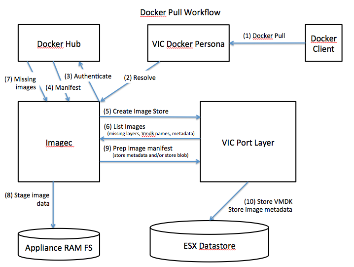

### How VIC manages filesystem images

A big part of a container runtime is how it uses and manages filesystem images. There are various approaches to managing container images, but the net result needs to be enough binaries to run the main container process. Those binaries may infact be a single statically-linked executable, or it could be operating system dependencies, third party libraries etc.

Given that each containerVM in VIC does not share a filesystem with anything else, for a container VM to be functional, it requires the following:
* OS binaries from which to boot. These are contained in the ISO attached to the containerVM
* A disk, representing the container filesystem, mounted at "/". The disk may contain OS libraries, but must contain the binaries corresponding to the entry point of the container. The disk will typically be R/W and the underlying implementation may capture all reads into a layer which can be committed into a snapshot
* 0 or more R/W disks which persist beyond the lifespan of the container

#### Port Layer Storage

#### Imagec

Image resolution and the transfer of image data between an external repository and a local image store is something that should be able to happen out-of-band. This also means that it does not need to be a service that is tightly-coupled to any one VCH. A VCH should be able to make asynchronous requests to an image service which maintains a local image store. There is no reason the image store could not be shared between a number of VCHs. When an image is added to the store, the VCH should then be able to query the image store via the PortLayer for metadata about the image.

Given the out-of-band nature of this transaction, plus the potential for the exchange of image data to be be automated or even managed by a different control plane, it makes sense to provide a binary to allow for this. This binary is [imagec](../../../master/cmd/imagec/README.md) described [here](components.md#imagec)

#### Image metadata

Image metadata arguably consists of two distinct types: Immutable metadata that is added to the image on creation/push and contextual data that can be added by the user of an image to facilitate publishing/referencing. Given that a single image can be deployed by multiple users, there is also a scoping aspect to this distinction: Immutable image metadata is coupled to the image and is consumed by all users of the image; whereras user metadata exists within the context of a particular use of the image. As such, user metadata is scoped to a VCH and image metatdata is scoped to an image store. Both need to be persisted.

#### High-level control flow

This diagram gives a high-level overview of the control flow between the various components.

