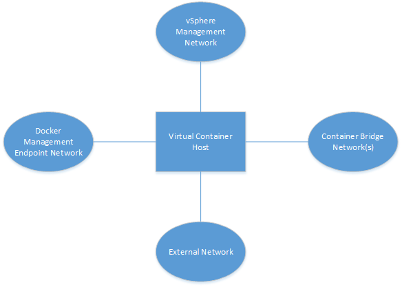
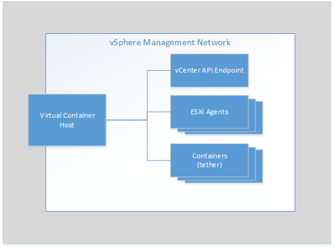
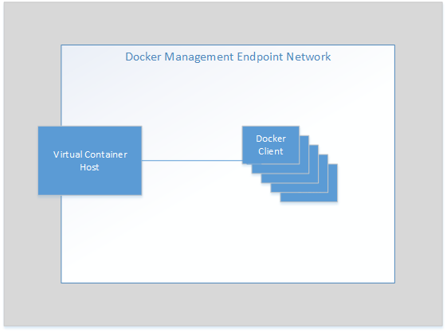
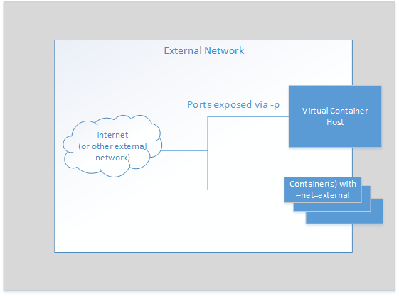
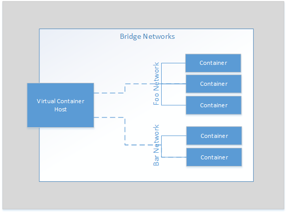

# Networking in vIC
This document provides a high level overview of how the networking will
work in vIC for MVP. After reading this document you should have a good
idea of how different components in vIC are connected to each other,
and how they use those networks.

<!-- START doctoc generated TOC please keep comment here to allow auto update -->
<!-- DON'T EDIT THIS SECTION, INSTEAD RE-RUN doctoc TO UPDATE -->

- [High level overview of networks for MVP](#high-level-overview-of-networks-for-mvp)
  - [vSphere Management Network](#vsphere-management-network)
  - [Docker Management Endpoint Network](#docker-management-endpoint-network)
  - [External Network (ie. route to Internet)](#external-network-ie-route-to-internet)
  - [Container Bridge Network(s)](#container-bridge-networks)
- [Docker Networking and the Port Layer](#docker-networking-and-the-port-layer)
- [Use Cases](#use-cases)
  - [Container with published port](#container-with-published-port)
    - [Description](#description)
    - [User Workflow](#user-workflow)
    - [Expected Outcome](#expected-outcome)
  - [Simple bridge network](#simple-bridge-network)
    - [Description](#description-1)
    - [User Workflow](#user-workflow-1)
    - [Expected Outcome](#expected-outcome-1)
  - [Bridged containers with exposed port](#bridged-containers-with-exposed-port)
    - [Description](#description-2)
    - [User Workflow](#user-workflow-2)
    - [Expected Outcome](#expected-outcome-2)
  - [Container using external network](#container-using-external-network)
    - [Description](#description-3)
    - [User Workflow](#user-workflow-3)
    - [Expected Outcome](#expected-outcome-3)

<!-- END doctoc generated TOC please keep comment here to allow auto update -->

##  High level overview of networks for MVP

There are four network types connected to a VCH. At VCH creation there
will be at least one of each network. Additional network configurations
are explained later in this document.

### vSphere Management Network  

The VCH will use the vSphere Management Network to communicate with
vCenter and the hosts as needed. In addition, the tether within the
containers are expected to use the management network to connect with
the VCH (using either serial-over-LAN or vSocket, etc).

### Docker Management Endpoint Network  

We need to allow customers to isolate the docker endpoint from the
more public external network. This will basically allow for a
"management" network for Docker without requiring the Docker clients
to have access to the vSphere Management network.

vIC will support published ports on the default bridged network using
`run -p` or `run -P` however that solution makes the VCH a single
point of failure for the external networking of containers. We are introducing the concept of an external network to remove this single
point and to allow for greater scalability and flexibility in
*published* services offered by containers.

### External Network (ie. route to Internet)

Typically the interface on the Docker Host is shared by both the
Docker endpoint and the containers that are publishing ports. In vIC
we are promoting a more scalable solution where the containers that
want to publish network services should be configured on a *external*
network and not use NAT through the VCH.

For the VCH, an external network is connected to the VCH and used
by the VCH as the default interface for *published* ports of containers
when those containers are using the *default* bridge network.

In addition, once the external network is defined, containers can
be deployed directly on the external interface and do not need
to go through the VCH.

### Container Bridge Network(s)

The bridge networks allow the containers to talk to each other. In
addition the bridge network is used when the container is
configured to expose a port via the VCH. The user can map ports
on the external network of the VCH to a port on a specific
container. Therefore the VCH is also on all bridge networks.

> Note that vSphere Integrated containers does not support the host
networking driver for docker. Since each container is running in a
VM the networking stacks cannot be shared as with host mode networking.

## Docker Networking and the Port Layer

The Port Layer implements network scopes that generally map into the
networks that show during a `docker network ls`. For MVP, networks
that are tied into the infrastructure will be configured within vSphere.
Which of those pre-configured networks are available to a VCH is
determined by the networks that are part of the VCH provisioning, or
added via a VCH reconfigure.

##  Use Cases

For our MVP we will start with a few sample use cases that should be
working and tested. Each use case should work independently as well as
concurrently.

### Container with published port

#### Description
Launch a container and expose a port via the VCH using `run -p`.
Test by connecting to the container via the external mapped
port on the external interface of the VCH.

>**NOTE:** This is used for compatibility with the way that most
docker containers publish ports. vIC promotes the use of the external
networks for published ports as a more resilient and scalable solution.

#### User Workflow

    $ docker run -p 8080:80 --name test1 my_container my_app

#### Expected Outcome

Port layer will:
 * connect *test1* to the default bridge network
 * expose port 80 on container *test1*
 * setup NAT mapping port 8080 on the external interface of the VCH
 to port 8080 on the internal bridge interface of *test1*

User expects port 80 on *test1* to be accessible via the
external network interface on the VCH at port 8080.

### Simple bridge network

#### Description
Create a new non-default bridge network and setup two containers on the
network. Ensure those containers can locate and communicate with
each other.

#### User Workflow

    $ docker network create -d bridge my-bridge-network
    $ docker network ls
    ...
    NETWORK ID          NAME                DRIVER
    615d565d498c        my-bridge-network   bridge
    ...
    $ docker run -d --net=my-bridge-network \
                    --name=server my_server_image server_app
    $ docker run -it --name=client --net=my-bridge-network busybox
    / # ping server
    PING server (172.18.0.2): 56 data bytes
    64 bytes from 172.18.0.2: seq=0 ttl=64 time=0.073 ms
    64 bytes from 172.18.0.2: seq=1 ttl=64 time=0.092 ms
    64 bytes from 172.18.0.2: seq=2 ttl=64 time=0.088 ms

#### Expected Outcome
Port layer will:
 * Allocate(\*) a new bridge network for `network create` command
 * Provide IP and name services to the containers created/attached
 to that network

User expects server and client can ping each other by name.

(\*) *Note that for MVP the bridge networks may all reside on a single
port group and only be separated by IP space. This will be addressed
post MVP with NSX integration.*

### Bridged containers with exposed port

#### Description

Combine the two examples above. Connect two containers on a
bridge network and setup one of the containers to publish
a port via the VCH.

#### User Workflow

We're going to assume server_app binds to port 5000.

    $ docker network create -d bridge my-bridge-network
    $ docker network ls
    ...
    NETWORK ID          NAME                DRIVER
    615d565d498c        my-bridge-network   bridge
    ...
    $ docker run -d -p 5000:5000 --net=my-bridge-network \
                    --name=server my_server_image server_app
    $ docker run -it --name=client --net=my-bridge-network busybox
    / # ping -c 3 server
    PING server (172.18.0.2): 56 data bytes
    64 bytes from 172.18.0.2: seq=0 ttl=64 time=0.073 ms
    64 bytes from 172.18.0.2: seq=1 ttl=64 time=0.092 ms
    64 bytes from 172.18.0.2: seq=2 ttl=64 time=0.088 ms
    / # telnet server 5000
    GET /

    Hello world!Connection closed by foreign host
    $ telnet vch_external_interface 5000
    Trying 192.168.218.137...
    Connected to 192.168.218.137.
    Escape character is '^]'.
    GET /

    Hello world!Connection closed by foreign host.

#### Expected Outcome
Port layer will:
 * Allocate(\*) a new bridge network for `network create` command
 * Provide IP and name services to the containers created/attached
 to that network
 * setup NAT mapping port 5000 on the external interface of the VCH
 to port 5000 on the *my-bridge-network* interface of *server*

User expects:
 * *server* and *client* can ping each other by name.
 * can connect to *server* on port 5000 from *client* container
  and by connecting to port 5000 on the VCH external interface.

### Container using external network

> **NOTE:** For MVP all the "external" networks will be configured
on the vSphere side and associated with a VCH at VCH creation time
or during a VCH reconfigure. Port Layer/Docker endpoint self service
for external networks is a post-MVP feature.

#### Description
In this use case we assume a couple external networks have been setup
on the vSphere side.

`default-external` is `10.2.0.0/16` and has a gateway @ `10.2.0.1`  
`vic-production` is `208.91.3.0/24` and has a gateway @ `208.91.3.1`  

The VCH is attached to the *default-external* network at 208.91.3.2.

Therefore `docker network ls` shows the following:

    $ docker network ls
    NETWORK ID          NAME                DRIVER
    e2113b821ead        none                null
    37470ed9992f        default-external    bridge
    ea96a6b919de        vic-production      bridge
    b7e91524f3e2        bridge              bridge  

The user has a container providing a web service that they want to
expose outside of the vIC environment.

#### User Workflow
For MVP, the networks have been setup and added to the VCH during
VCH creation or reconfigure.

The output of `docker network inspect default-external` is:

    [
        {
            "Name": "default-external",
            "Id": "37470ed9992f6ab922e155d8e902ca03710574d96ffbfde1b3faf541de2a701f",
            "Scope": "external",
            "Driver": "bridge",
            "IPAM": {
                "Driver": "default",
                "Options": {},
                "Config": [
                    {
                        "Subnet": "10.2.0.0/16",
                        "Gateway": "10.2.0.1"
                    }
                ]
            },
            "Containers": {},
            "Options": {}
        }
    ]

And the output of `docker network inspect vic-production` is:

    [
        {
            "Name": "vic-production",
            "Id": "ea96a6b919de4ca2bd627bfdf0683ca04e5a2c3360968d3c6445cb18fab6d210",
            "Scope": "external",
            "Driver": "bridge",
            "IPAM": {
                "Driver": "default",
                "Options": {},
                "Config": [
                    {
                        "Subnet": "208.91.3.0/24",
                        "Gateway": "208.91.3.1"
                    }
                ]
            },
            "Containers": {},
            "Options": {}
        }
    ]

The user would do the following to setup a server on the
vic-production network.

    $ docker run -d --expose=80 --net=vic-production --name server my_webapp
    $ docker inspect --format='{{range .NetworkSettings.Networks}}{{.IPAddress}}{{end}}' server
    208.91.3.2
    $ telnet 208.91.3.2 80
    Trying 208.91.3.2...
    Connected to 208.91.3.2.
    Escape character is '^]'.
    GET /

    Hello world!Connection closed by foreign host.

>**NOTE:** The user could also just use -p 80 or -p 80:80 instead of
--expose=80. Trying to map to different ports with -p will result in a
configuration error.

#### Expected Outcome

The Port Layer will add the container *server* to the
*vic-production* network.  

The user expects the *server* container to have it's port exposed on
the external network *vic-production*.
